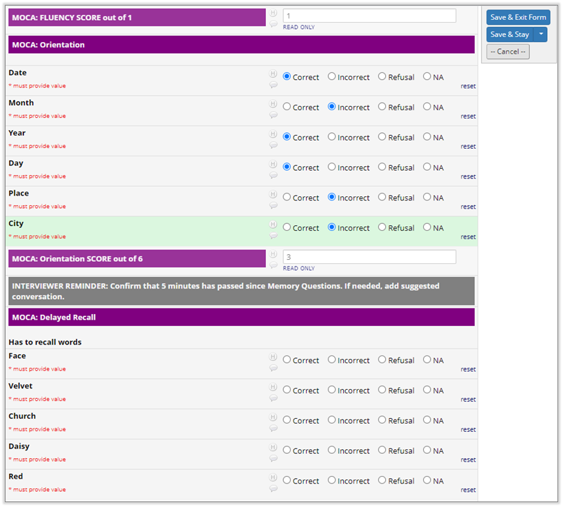
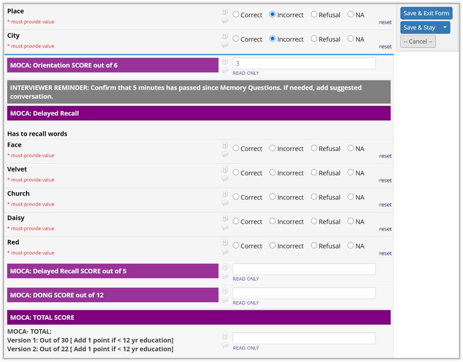

# Stay Focused!
Version 1.0.0   
October 2020  Pete Charpentier and the REDCap@Yale team  
https://portal.redcap.yale.edu
redcap@yale.edu

> Tested on:
> - REDCap versions 9.1.23, 10.2.3
> - PHP 5.6, 7.0, 7.1, 7.2
> - Javascript 5, 6

### What does it do?
The Stay Focused! external module does just three things, all meant to help you manage the situation 
in which you must periodically save your work as you conduct an interview or enter a long REDCap form:
1. After you have clicked **Save & Stay** and the page reloads, the form is repositioned to the last field you entered.  

2. It marks the place where you left off with a bright blue horizontal bar, so that you can track
how much data entry or data collection you have performed since your last save.

3. It suppresses the post-save display of the popup dialog alerting you to required fields that are blank.
This alert is not useful in the Save & Stay context because there will almost certainly be required but blank fields,
since the data entry is in progress. More importantly, it can interrupt the flow of an interview. 
The post-save popup dialog *will* be displayed under any other Save context (Save & Exit, Save & Next Form).

### Example
In the screen shot below, the user is conducting a telephone interview. She has been instructed to periodically click the
**Save & Stay** button to guard against data loss from a wobbly Internet connection.

After completing a section of a cognitive assessment, she decides to save her work. Here is the form before she clicks
the **Save & Stay** button: 

After she clicks **Save & Stay** the page refreshes as usual, but instead of
the focus returning to the top of the form, the form scrolls
to the last entered item and places a blue line beneath.

### How it works
Stay Focused! works by detecting non-blank data entry and clicks on special links like file upload and econsent, and remembering the field name. 
When either the bottom or the "floating" **Save & Stay** button is clicked, Stay Focused! Saves the name of the last field entered or updated into a cookie. 
After the page is reloaded the cookie is fetched and the name of the last field is retrieved, the cookie is deleted, the form is scrolled to the proper
location, and the data entry boundary is marked with a bright blue horizontal bar.  

Note: the Stay Focused! cookie stores *only* the name of the last field entered or updated.
The cookie should be deleted immediately upon page reload, but in any event has a maximum lifespan of 2 minutes.

#### Browser Requirements
1. ECMAScript 5 (JavaScript 5 - 2009) or higher. Any modern browser should work.
2. Cookies must be allowed from your REDCap domain. This is probably already the case.
