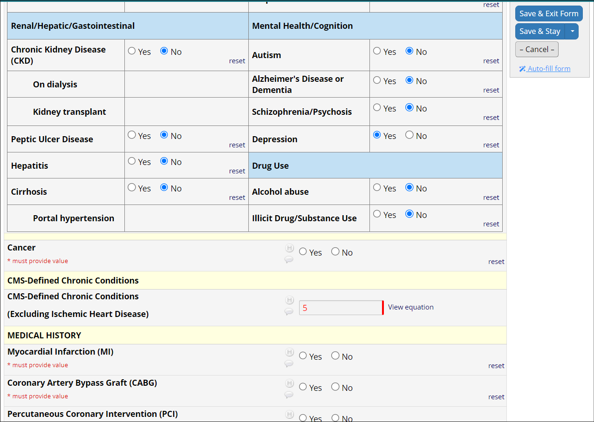

# Stay Focused!
Version 1.0.1   
June 2024  Pete Charpentier and the REDCap@Yale team  
https://portal.redcap.yale.edu
redcap@yale.edu

### What does it do?
The Stay Focused! external module does just three things, all meant to help you manage the situation 
in which you must periodically save your work as you conduct an interview or enter a long REDCap form:
1. After you have clicked **Save & Stay** and the page reloads, the form is repositioned to the last field you entered.  

2. It marks the place where you left off with a bright blue horizontal bar, so that you can track
how much data entry or data collection you have performed since your last save.

3. It suppresses the post-save display of the popup dialog alerting you to required fields that are blank.
This alert is not useful in the Save & Stay context because there will almost certainly be required but blank fields,
since the data entry is in progress. More importantly, it can interrupt the flow of an interview. 
The post-save popup dialog *will* be displayed under any other Save context (Save & Exit, Save & Next Form).

### Example
In the screen shot below, the user is conducting a telephone interview. He has been instructed to periodically click the
**Save & Stay** button to guard against data loss from a wobbly Internet connection.

After completing a section of a cognitive assessment, he decides to save his work. Here is the form before he clicks
the **Save & Stay** button: 

After he clicks **Save & Stay** the page refreshes as usual, but instead of
the focus returning to the top of the form, the form scrolls
to the last entered item and places a blue line beneath.

### How it works
Stay Focused! works by detecting non-blank data entry and clicks on special links like file upload and econsent, and remembering the field name. 
When either the bottom or the "floating" **Save & Stay** button is clicked, Stay Focused! Saves the name of the last field entered or updated into a "localStorage" item, which is a Javascript data storage resource that persists between browser sessions. 
After the page is reloaded the name of the last field is retrieved from localStorage, the form is scrolled to the proper
location, and the data entry boundary is marked with a bright blue horizontal bar.

> PLEASE NOTE  
> Stay Focused! makes certain assumptions about the REDCap data entry form user interface, which may change over time. There is a possibility that Stay Focused! and REDCap will drift apart at some point, due to changes in the REDCap UI. If Stay Focused! is not working for you, please get in touch with us at redcap@yale.edu. This version of Stay Focused! was tested on REDCap version 14.0.31.

